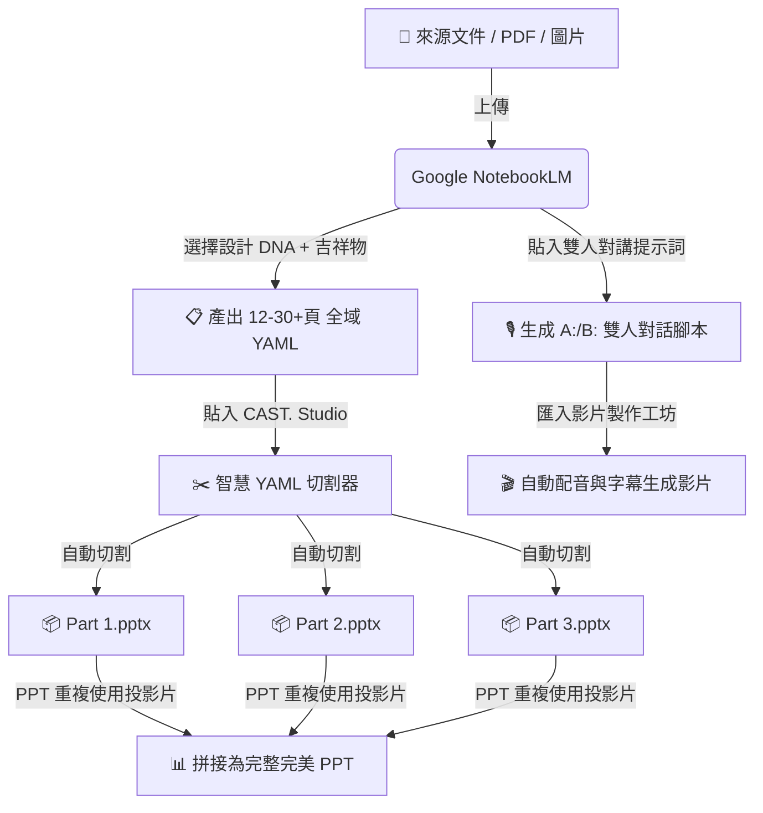

# 🎬 CAST. Studio | NotebookLM 簡報限制突破與雙人口白對談提示詞主控台

> **專為 Google NotebookLM (NBLM) 量身打造的全域長簡報規劃、17款視覺DNA、吉祥物貫穿與雙人口白對話提示詞主控台。**  
> 採用現代深色玻璃擬物風格 (Dark Glassmorphic UI) 設計，無需安裝任何伺服器或依賴庫，純靜態網頁開啟即用！

---

## 🌟 為什麼需要 CAST. Studio？

使用 **Google NotebookLM** 進行簡報生成與影片口白製作時，創作者常遇到以下三大痛點：

1. **簡報單次生成頁數上限 (約 10-15 頁)**： NotebookLM 在單次對話中無法一口氣輸出 20 頁以上的長簡報。
2. **視覺風格抽象雜亂或背景過深**： AI 簡報色調容易過於深暗刺眼或每一頁風格迥異，難以維持統一的設計 DNA。
3. **講解口白缺乏對話感與 TTS 語音合成崩潰問題**： 自動生成的雙人口白容易變成單向長篇大樓；或因包含括號、引號、諧音字等導致 TTS 語音配音生成無聲或錯誤。

**CAST. Studio** 透過獨家的 **全域 YAML 規劃提示詞**、**17款視覺 DNA 藝廊**、**雙主角對談構圖引擎** 與 **智慧 YAML 切割器**，為您徹底解決這些難題！

---

## ✨ 核心功能亮點

### 📊 1. 簡報 12-30 頁限制突破 (Slide Helper & YAML Splitter)
* **全域 12-30+ 頁簡報規劃**：引導 NotebookLM 全盤評估筆記本來源，一口氣規劃出具備全域連貫性的 YAML 架構（不再自我設限在 10 頁內）。
* **簡報 YAML 智慧切割器**：複製完整 YAML 貼入，自動依 10 頁/12 頁上限切割為 `Part 1`、`Part 2` ... 並自動插入**風格錨點頁**與**過渡緩衝頁**。
* **PowerPoint 完美無損合併指引**：運用 PowerPoint 內建「重複使用投影片 (Reuse Slides)」與「保留來源格式 (Keep Source Formatting)」，10 秒無損拼接完美長簡報。

### 🎨 2. 17 款簡報設計風格藝廊 (Presentation Design Style Gallery)
* **全域 17 款視覺 DNA 膠囊**：
  - `🪄 自動推導風格 (讓 NBLM 自己決定)` *(預設可選)*
  - `💻 專業企業商務` / `📄 白底商務簡約` / `📈 白底高階財經`
  - `✍️ 手繪日記風格+主角` / `🍨 3D 奶油 UI 科技` / `📖 雜誌編輯` / `🎨 溫馨插畫`
  - `⬛ 高對比度極簡` / `🧊 2.5D 等距視角` / `🎨 扁平化插畫` / `🌿 北歐簡約插畫`
  - `✨ 漸層玻璃擬態` / `🎮 教育型遊戲 UI`
  - 🧪 **`化工製程與實驗科學風格`** *(專為實驗室/工程設備量身打造)*
  - ⚠️ **`工安事故分析與警示風格`** *(專為安全檢討/避險演練量身打造)*
  - 🔬 **`科普研究與技術解密風格`** *(專為技術拆解/學術科普量身打造)*
* **即時色號動態注入**：點擊任何風格膠囊，提示詞內的 YAML `color_scheme` 與色號標籤會**毫秒級即時寫入**！
* **明亮潔淨底色優先**：全面優化設計預設（ Morandi 白、微亮藍白、米白），確保投影片高對比度、可讀性極佳，避免深色底雜訊。

### 🎭 3. 吉祥物視覺貫穿與雙主角對談模式 (Single & Dual Mascot Continuity)
* **三種貫穿模式自由切換**：
  - `🚫 【不套用吉祥物】`（純標準簡報簡約風格）
  - `👤 【單主角貫穿模式】`（單一吉祥物故事引導）
  - `👥 【雙主角對談模式】`（雙人口白/主持人與協同專家演練）
* **📐 雙主角投影片構圖規範 (Composition Rules)**：
  - **角色 A (引導/主持人)**：固定於投影片**【左下角】**，姿態與眼神朝向右方內容大標題。
  - **角色 B (解答/協同者)**：固定於投影片**【右下角】**，姿態與眼神朝向左方數據卡片。
  - **中央聚焦構圖**：中央放置核心資訊卡片與數據圖表，營造雙人臨場對談感。
  - **視覺極致簡潔高雅**：**嚴禁對話氣泡與漫畫框雜訊**。
* **一鍵複製生圖 Prompt**：內建按鈕 `📋 複製生圖 Prompt`，可一鍵複製單人或雙主角合體的 AI 角色繪圖指令！

### 🎙️ 4. 雙人對話與講解口白腳本 (Slide Narrative & Dialogue Console)
* **雙發言模式切換**：支援 **`👤 單人獨白模式`** 與 **`🎙️ 雙人對談模式 (Host A & Guest B)`** 一鍵動態切換。
* **100% 遵照《雙人對話腳本格式指南》**：角色 A 發言標籤 `A:` / `A：`；角色 B 發言標籤 `B:` / `B：`。
* **⚡ 頻繁有來有往 (Multi-Turn Exchange Engine)**：每一頁解說包含 2 至 4 個回合 (4~8 句) 的角色交替互動。
* **🛡️ 語音合成防崩潰機制**：提示詞自動植入 TTS 穩定條款（禁用中英文括號、引號、標示星號與諧音字）。

---

## 🛠️ 工作流程與架構 (Workflow)



---

## 🚀 快速開始 (Quick Start)

本專案為純靜態網頁（Pure Static HTML/CSS/JS），無需安裝 Node.js 或執行任何構建命令。

1. **複製本專案**：
   ```bash
   git clone https://github.com/your-username/NBLM-Slide-Console.git
   cd NBLM-Slide-Console
   ```
2. **開啟工具**：
   直接雙擊開啟 **`nblm_ppt_helper.html`**（或開啟 `index.html`）即可在瀏覽器中使用！

---

## 📁 專案檔案結構 (Project Structure)

```text
.
├── nblm_ppt_helper.html        # 主控台主要網頁 GUI (極致直觀命名)
├── index.html                  # 透明跳轉入口網頁 (自動跳轉至 nblm_ppt_helper.html)
├── app.js                      # 全域設計 DNA、雙主角構圖與 YAML 切割演算法 (Vanilla JS)
├── style.css                   # 現代深色玻璃擬物 UI 設計系統 (Vanilla CSS)
├── favicon.ico                 # 專案網頁圖示檔 (多尺寸 16~256px ICO)
├── nblm_ppt_helper_icon.png    # 高畫質 3D 圖案原始 PNG (512x512)
├── images/                     # 實體 AI 生圖範本縮圖
└── README.md                   # 專案介紹說明文件
```

---

## 📄 授權條款 (License)

本專案採用 **MIT License** 授權，歡迎自由修訂、分發與個人/商業使用。

---

&copy; 2026 CAST. Studio Slide & Narrative Edition. All rights reserved.
